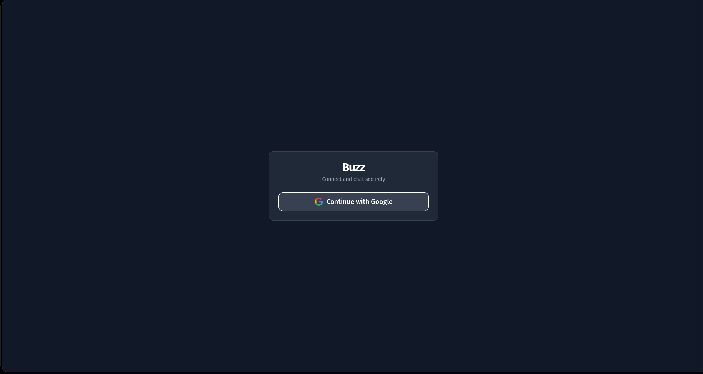
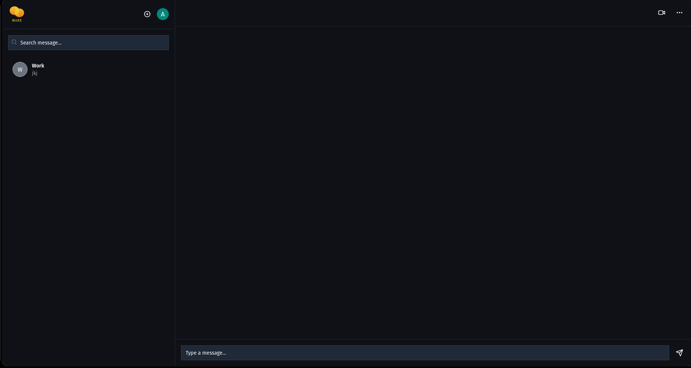

# Buzz Chat

Afsal Majeed 
MS22BTECH11003
IIT Hyderabad
Material Science and Metallurgical Engineering

Buzz Chat is a realtime chat application build with React, Express, Socket.io and MongoDB.

## Features
- Google OAuth authentication
- Real-time messaging with Socket.io
- Persistent chat data using MongoDB

### Setup Instructions
1. Clone the repository
git clone https://github.com/CodeWhizAfsal/buzz

2. Go to project folder
cd buzz

#### ENV guide
.env.example is present in both frontend and backend
Rename it to .env
Change required values

#### Backend
1. Go tobackend folder
cd backend

2. Install packages
yarn install

3. Run Server
node index.js

#### Frontend
1. Go to frontend folder
cd frontend

2. Install packages
yarn install

3. Run Frontend
yarn dev

## Usage
1. Ensure both frontend and backend are running
2. Go to [https://localhost:5173/login](https://localhost:5173/login) and login with Google